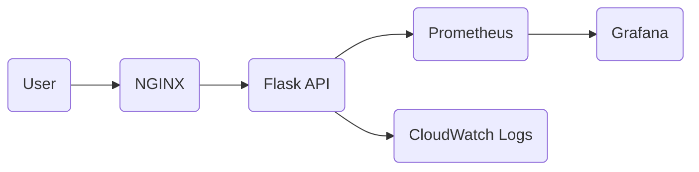

# 🚀 DevOps Production Project

## 📌 Overview

This project demonstrates end-to-end DevOps practices including containerization, CI/CD, Infrastructure as Code and monitoring.

The system is designed to be:

* Scalable
* Observable
* Easy to deploy
* Production-ready (design level)

---

## 🧩 Tech Stack

* Backend: Python (Flask)
* Containerization: Docker
* Reverse Proxy: NGINX
* Monitoring: Prometheus + Grafana
* CI/CD: GitHub Actions
* Infrastructure: Terraform (AWS)

---

## ⚙️ Features

* REST API with health check and data endpoint
* Dockerized application
* NGINX reverse proxy routing
* Prometheus metrics collection
* Grafana dashboard visualization
* Terraform infrastructure design (AWS-ready)
* CI/CD pipeline for automated build

---

## 🔗 API Endpoints

### ✅ GET /health

```bash
curl http://localhost:8080/health
```

Response:

```json
{ "status": "ok" }
```

---

### ✅ POST /data

```
Invoke-RestMethod -Uri http://localhost:8080/data `
  -Method POST `
  -Body '{"name":"devops","project":"test"}' `
  -ContentType "application/json"
```

Response:

```json
{
  "received": {
    "name": "devops"
  }
}
```

---

## 🐳 Run Locally

pip install -r requirements.txt  
python app/main.py  

---

## Run Full System

docker-compose up --build  

---

## 🌐 Access Services

| Service         | URL                   |
| --------------- | --------------------- |
| API (via NGINX) | http://localhost:8080 |
| Prometheus      | http://localhost:9090 |
| Grafana         | http://localhost:3000 |

---

## 📊 Monitoring

### Metrics Endpoint

```
http://localhost:5000/metrics
```


### Generate Traffic

```powershell
1..50 | ForEach-Object { Invoke-RestMethod http://localhost:8080/health }
```
---

## 📈 Grafana Dashboard


* Data Source: Prometheus
* URL: `http://prometheus:9090`


### Sample Queries

```promql
app_requests_total
rate(app_requests_total[1m])
up
```

---

## 🚨 Alerting Strategy

* Alert when request rate drops below threshold
* Indicates potential service outage
* Can be integrated with Slack / Email

---

## ☁️ Infrastructure as Code (Terraform)

The Terraform configuration includes:

* VPC (network isolation)
* Public subnet
* Internet Gateway
* Security Groups (ports 80, 8080, 9090, 3000)
* EC2 instance (application host)
* CloudWatch logging

---

## 🏗️ Architecture



---

## 🚀 Deployment Design (AWS)

1. User → Application Load Balancer
2. ALB → ECS / EC2 (Docker container)
3. Metrics → Prometheus
4. Visualization → Grafana
5. Logs → CloudWatch

---

## 🔄 CI/CD Pipeline

* Triggered on GitHub push
* Builds Docker image
* Validates configuration

---

## 🧠 Key DevOps Practices Demonstrated

* Infrastructure as Code
* Container orchestration readiness
* Observability (metrics + logs)
* Reverse proxy architecture
* Automation via CI/CD

---

## 📌 Summary

This project showcases a complete DevOps workflow from development to deployment design, with a strong focus on reliability, monitoring and scalability.

---

